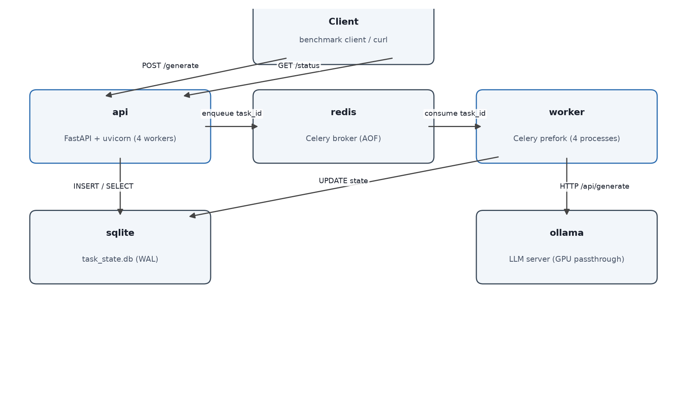
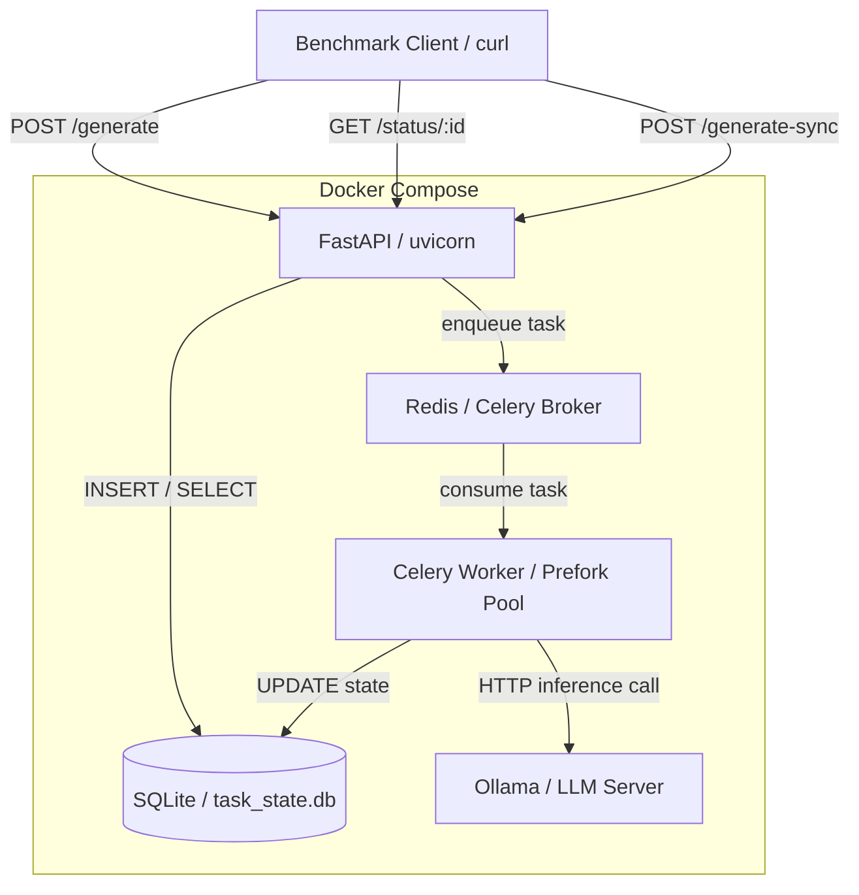

# Async LLM API Gateway

FastAPI, Celery, Redis, SQLite

**Problem:** Synchronous LLM inference blocks server threads. Causes connection exhaustion and HTTP 504 timeouts.

**Solution:** Engineered a non-blocking API gateway. Offloaded payloads into a Redis-backed Celery queue for asynchronous background processing.

**Impact:** Inference is fully off the request path: the API returns `202` after a single indexed SQLite insert, regardless of backend load. A ramped-concurrency benchmark (10-500) measures drop rate, P50/P95/P99 latency, and throughput for both the async path and a synchronous baseline. Results are produced by running the included benchmark (see Benchmarking).

---

## Abstract

This repository implements a containerized asynchronous gateway for LLM inference. It separates request acceptance from model execution. A client submits a prompt and receives a `task_id` immediately. Background workers perform the inference and persist the result to SQLite. The client polls a status endpoint until the task reaches a terminal state.

The gateway is built on four containers. FastAPI accepts HTTP requests. Redis transports task identifiers between the API and a Celery worker pool. SQLite stores the full task state machine. Ollama (or a stochastic mock backend) executes the model call.

A synchronous baseline endpoint ships alongside the async path. Both ship in the same container image with identical configuration; the only architectural difference is the queuing path. The benchmark suite compares the two under identical load profiles. It measures drop rate, latency percentiles, and throughput at five concurrency levels. The async path is expected to hold near-zero drop rate at 500 concurrent requests. The sync path is expected to saturate its bounded executor thread pool under load; its collapse point is a measured output of the benchmark, not a fixed number.

This project is a system-design study. Three of the four services carry a healthcheck (the worker exposes readiness through its startup retry logic). Every state transition uses an atomic compare-and-swap guard. Every infrastructure failure mode has a documented fallback. The design decisions and their trade-offs are recorded in `discussion.md` in this repository.

---

## Architecture





### Request lifecycle

1. Client posts a prompt to `POST /generate`.
2. The API validates the body, inserts a `QUEUED` row into SQLite, then pushes the `task_id` onto the Redis queue. The insert happens before the push. A task that exists anywhere exists in SQLite.
3. A prefork worker pops the `task_id` and claims it with an atomic update: `UPDATE tasks SET status='PROCESSING' WHERE task_id=? AND status='QUEUED'`. A zero-row result means the task was already claimed or expired, so the worker aborts without calling the model.
4. The worker calls the backend (mock sleep, or Ollama over HTTP) and writes the result: `UPDATE tasks SET status='SUCCESS' ... WHERE task_id=? AND status='PROCESSING'`. A zero-row result means the API already marked the task `TIMEOUT`, and the result is dropped.
5. The client polls `GET /status/{task_id}` until it sees `SUCCESS`, `FAILURE`, or `TIMEOUT`.

SQLite is the source of truth. Redis is a queue transport with AOF persistence, not a state store. Celery runs without a result backend; all state transitions are explicit SQL writes.

---

## Prerequisites

- Docker 20.10 or newer, with Docker Compose v2
- 4 GB free RAM for the default stack
- Optional: an NVIDIA GPU with `nvidia-container-toolkit` installed for hardware-accelerated Ollama inference
- Optional: Python 3.11+ with `httpx` for running the benchmark client from the host

The default `MOCK_MODE=true` stack needs no GPU and no model download (first-run Docker image pulls still require network).

---

## Quick start

```bash
docker compose up --build
```

The API is reachable at `http://localhost:8000` once all three services report healthy. Verify:

```bash
curl http://localhost:8000/health
# {"status":"ok","redis":"connected","db":"connected"}
```

Submit an async request:

```bash
curl -X POST http://localhost:8000/generate \
  -H "Content-Type: application/json" \
  -d '{"prompt":"Explain quantum computing in one paragraph"}'
# 202 {"task_id":"<uuid>","status_url":"/status/<uuid>"}
```

Poll the status endpoint every 200-500 ms. The mock backend sleeps 2-6 seconds before completing:

```bash
curl http://localhost:8000/status/<task_id>
# {"status":"QUEUED"}   (initial)
# {"status":"SUCCESS","result":{"generated_text":"This is a canned mock response.","total_time_ms":4213,...}}
```

---

## API reference

| Endpoint | Method | Description | Key response |
| --- | --- | --- | --- |
| `/generate` | POST | Submit an async LLM request | `202` with `task_id` and `status_url` |
| `/status/{task_id}` | GET | Poll task state | `200` with status and, on success, the result |
| `/generate-sync` | POST | Synchronous baseline (blocks) | `200` with the result, or `503` on backend failure |
| `/health` | GET | Infrastructure status | `200` with `redis` and `db` connection state |

### POST /generate

```bash
curl -X POST http://localhost:8000/generate \
  -H "Content-Type: application/json" \
  -d '{"prompt":"Explain quantum computing","temperature":0.7,"max_tokens":256,"model":"tinyllama"}'
```

Validation failures return `422`. An unreachable task database returns `503`. Redis being down does not fail the request: the row is inserted, the enqueue is skipped with a logged warning, and the API still returns `202`.

### GET /status/{task_id}

```bash
curl http://localhost:8000/status/<task_id>
```

| Status | Meaning |
| --- | --- |
| `QUEUED` | Inserted, waiting in the queue |
| `PROCESSING` | A worker claimed it and is running inference |
| `SUCCESS` | Done; `result` carries `generated_text`, `total_time_ms`, `tokens_generated`, `tokens_per_second` |
| `FAILURE` | Backend error; `error` holds the message, `retryable` says whether resubmitting is safe |
| `TIMEOUT` | Exceeded `TASK_TTL` while `QUEUED` or `PROCESSING`; terminal |

Unknown `task_id` returns `404`.

### POST /generate-sync

```bash
curl -X POST http://localhost:8000/generate-sync \
  -H "Content-Type: application/json" \
  -d '{"prompt":"Hello"}'
```

This endpoint blocks until inference completes. It exists only as the benchmark baseline. It returns `503` on backend failure; under thread-pool saturation the client observes connection errors or timeouts, all of which the benchmark counts as failures.

---

## Client guidance

- Poll `GET /status/{task_id}` every 200-500 ms. Faster polling creates read pressure on SQLite for no latency gain.
- Treat 120 seconds as the per-task ceiling. Beyond that, assume the worker crashed or the task was lost.
- Tasks stuck past `TASK_TTL` (default 300 s) transition to `TIMEOUT` on the next poll. This is a lazy update: the row is mutated, not virtually reported, so a late worker result cannot resurrect the task.
- On `FAILURE`, inspect `retryable`. Resubmit only when it is `true`.

---

## Benchmarking

The benchmark drives ramped concurrent requests against both endpoints and writes machine-readable results after each concurrency level. A crash mid-run preserves every completed level.

### Prerequisites

```bash
pip install httpx   # host-side client; matplotlib only if you generate graphs
```

### Async run

```bash
python benchmark/run.py --mode async --concurrency 10 50 100 200 500
```

### Sync baseline run

```bash
python benchmark/run.py --mode sync --concurrency 10 50 100 200 500
```

### Flags

| Flag | Default | Meaning |
| --- | --- | --- |
| `--target` | `http://localhost:8000` | Base URL of the gateway |
| `--concurrency` | `10 50 100 200 500` | Concurrency levels, run in order |
| `--mode` | required | `async` or `sync` |
| `--output` | `benchmark/results.json` | Results file (incremental writes) |
| `--poll-interval` | `200` | ms between status polls |
| `--timeout` | `120` | seconds before a task counts as timed out |

### Graph

```bash
python benchmark/plot.py
```

This produces `benchmark/benchmark_results.png` (1200 x 800, 150 DPI): a dual-panel chart with drop rate on top and P99 latency below, async in blue circles (dashed) against sync in red squares (solid). Line styles differ as well as colors, so the chart stays readable in grayscale. If one results file is missing, the available series still renders; if both are missing, the script exits with instructions.

> **Status:** no benchmark artifacts are committed yet. Run the benchmark against a live stack (`run.sh` / the two `run.py` commands above), then run `plot.py`, and commit `results_async.json`, `results_sync.json`, and `benchmark_results.png` here. That chart is the deliverable for the thesis write-up.

---

## Mock vs Ollama mode

| Setting | Behavior |
| --- | --- |
| `MOCK_MODE=true` (default) | Worker sleeps a uniform 2-6 s and returns canned text. No GPU, no model download, deterministic delay envelope. |
| `MOCK_MODE=false` | Worker connects to Ollama at `OLLAMA_URL`. On first use it polls `/api/tags`, pulls `DEFAULT_MODEL` if missing (streaming progress logs), then runs inference through the HTTP API. |

`MOCK_FAILURE_RATE` (float 0.0-1.0) makes the mock backend raise `LLMBackendError("Simulated OOM")` with that probability, which exercises the FAILURE path and the `retryable` flag without touching real infrastructure.

---

## GPU passthrough

The Ollama container uses `runtime: nvidia` in `docker-compose.yml`. This requires `nvidia-container-toolkit` on the host. Without it, the Docker daemon rejects the compose file.

On a CPU-only host, comment out the `runtime: nvidia` line (the compose file carries the note) or use a compose override. Ollama then runs on CPU: slower, but fully functional.

Two mechanisms are deliberately absent. `deploy.resources` is Swarm-only and silently ignored by `docker compose up`. `NVIDIA_VISIBLE_DEVICES` is the legacy `nvidia-docker2` approach. `runtime: nvidia` alone is the modern, sufficient mechanism.

Verify with:

```bash
docker compose exec ollama nvidia-smi
```

---

## Environment variables

| Variable | Default | Description |
| --- | --- | --- |
| `REDIS_URL` | `redis://redis:6379/0` | Celery broker URL |
| `DB_PATH` | `/data/task_state.db` | SQLite file path |
| `OLLAMA_URL` | `http://ollama:11434` | Ollama HTTP API base |
| `MOCK_MODE` | `true` | Use the mock backend (no GPU needed) |
| `MOCK_FAILURE_RATE` | `0.0` | Probability the mock backend raises a simulated failure |
| `TASK_TTL` | `300` | Seconds before a stale task is marked `TIMEOUT` |
| `VALID_MODELS` | `tinyllama,llama3,llama3:8b` | Allowlist checked by the API when `MOCK_MODE=false` |
| `DEFAULT_MODEL` | `tinyllama` | Model pulled on first Ollama startup and used for routing |
| `MODEL_PULL_TIMEOUT` | `600` | Max seconds to wait for a model download |
| `LOG_LEVEL` | `info` | Logging verbosity |

---

## Architecture decisions

**SQLite with WAL mode for task state.** Zero infrastructure, one file, shareable through a Docker volume. WAL permits concurrent readers with a single serialized writer. `busy_timeout=5000` waits out transient contention, and a retry wrapper (5 attempts, 100 ms to 1.6 s backoff) catches the rest. The API uses `aiosqlite` so the event loop never blocks on disk I/O; prefork workers use plain `sqlite3`.

**Redis as Celery broker, not state store.** The queue runs with AOF persistence (`--appendonly yes --appendfsync everysec`) so messages survive container restart. Task state lives only in SQLite. Celery's result backend is disabled.

**Prefork worker pool.** Four processes, each with its own GIL, its own SQLite connection, and its own socket to Ollama. Prefork sidesteps the GIL for CPU-bound inference (theoretical ~4x on 4 cores; the default mock backend is deliberately I/O-idle, so the benchmark isolates queuing behavior instead). This is why the backend interface is synchronous: prefork workers have no event loop by default.

**INSERT-before-push invariant.** The SQLite insert always precedes the Redis push. If the push fails, the task stays `QUEUED` and the client still gets `202`; the TTL mechanism eventually resolves it. A `task_id` that exists anywhere exists in SQLite.

**Optimistic locking for every state transition.** Each transition guards on the current status (`WHERE status='QUEUED'`, `WHERE status='PROCESSING'`, `WHERE status IN ('QUEUED','PROCESSING')`). `rowcount` checks turn races into no-ops. No external locks, no background reaper, no state resurrection. `acks_late=True` re-delivers tasks after a worker crash; the atomic claim ensures only one worker executes inference.

**Sync baseline on the same image.** `POST /generate-sync` blocks a worker thread in the default executor (`run_in_executor` offload) for the full inference duration. Under load that bounded thread pool saturates and the server stops serving new requests. That collapse is the measured control group, not a bug.

**Known ceiling: SQLite write throughput.** WAL write serialization means many simultaneous writers contend behind a single write lock; the benchmark quantifies the actual degradation curve with the `p99_post_response_time_ms` metric instead of hiding it. Production scale would need Postgres or a dedicated state store; for this study the ceiling is documented evidence.

---

## Repository layout

```
├── api/            FastAPI app: routes, models, error handlers, producer Celery app
├── worker/         Celery app, run_inference task, LLM backends (base/mock/ollama)
├── common/         Shared SQLite layer (sync + async), JSON logging
├── benchmark/      run.py (load driver), plot.py (dual-panel graph)
├── tests/          API tests (no Docker) + integration suite (Docker, auto-skipped)
├── docs/           Generated artifacts (architecture diagram)
└── docker-compose.yml, Dockerfile, .env.example
```

## Verification

The no-Docker suite runs without any infrastructure:

```bash
py -m pytest tests/ -q          # 5 API tests pass, 7 Docker tests skip
py test_db_init.py              # schema, WAL, busy_timeout, retry wrapper
py test_concurrent_inserts.py   # 750 concurrent inserts, zero locked errors
```

The Docker integration suite (happy path, worker failure, Redis-down resilience, 404, 422, idle expiry, TIMEOUT race) runs under `pytest tests/test_integration.py` on a host with Docker, and skips cleanly without it.
